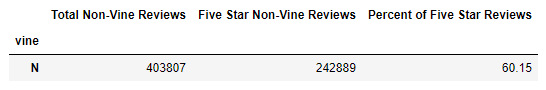

# Amazon_Vine_Analysis

## Overview of the Analysis
The purpose of this analysis is to determine whether there is bias for paid reviewers of products versus non-paid reviewers in the Amazon platform. This was accomplished by utilizing Google Colab, the AWS server, and sample Amazon data sets to create a dataframe that could be exported as a CSV using pgAdmin. That CSV was then analyzed in Jupyter Notebook using Pandas.

## Results
In the dataset examined, there were no Vine reviewers (paid reviewers), so it is not possible to tell the total number of Vine reviewers or the percentage of 5 star reviews that Vine reviers gave. The analysis here is on reviews for books, but the following other categories were also investigated to search for both paid and unpaid reviewers, but were unsuccessful: 
- Mobile app
- Health & personal care
- Electronics
- Videogames

Although it was impossible to get data for Vine reviewers, the code is still written as if there were and it was possible to identify data for non-Vine reviewers, since those were the only reviewers available. Below you can see a snapshot of the dataframe created for non-Vine or unpaid reviewers of Amazon books: 

## Summary
Because there are no Vine or paid reviewers in the dataset, it is not possible to tell whether there is bias in the Vine program. This is true because there is only a data point for 5 star reviews from the non-paid reviewers (60.15% 5 star reviews) and no comparison point. 

In order to make a proper analysis about the bias within a paid reviewer program, the dataset would need to contain both paid and unpaid reviewers.
